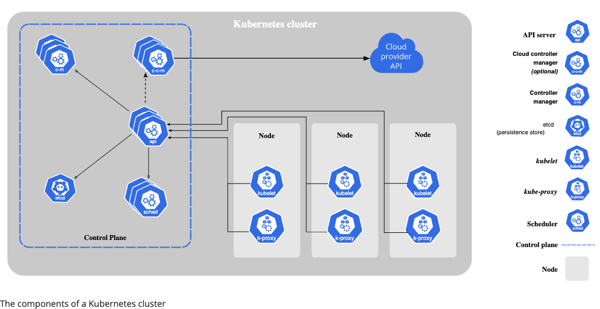
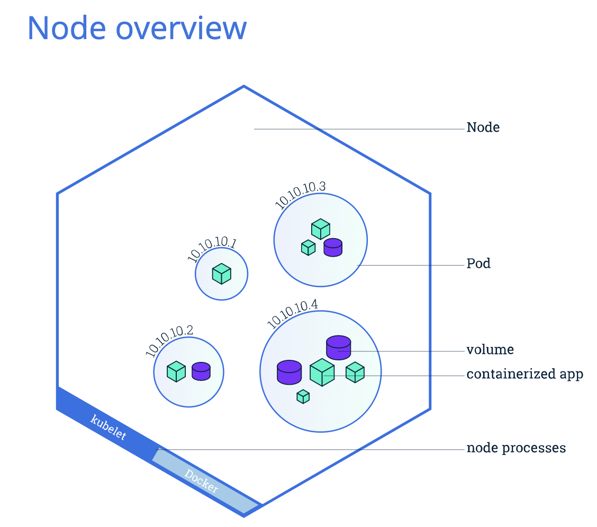
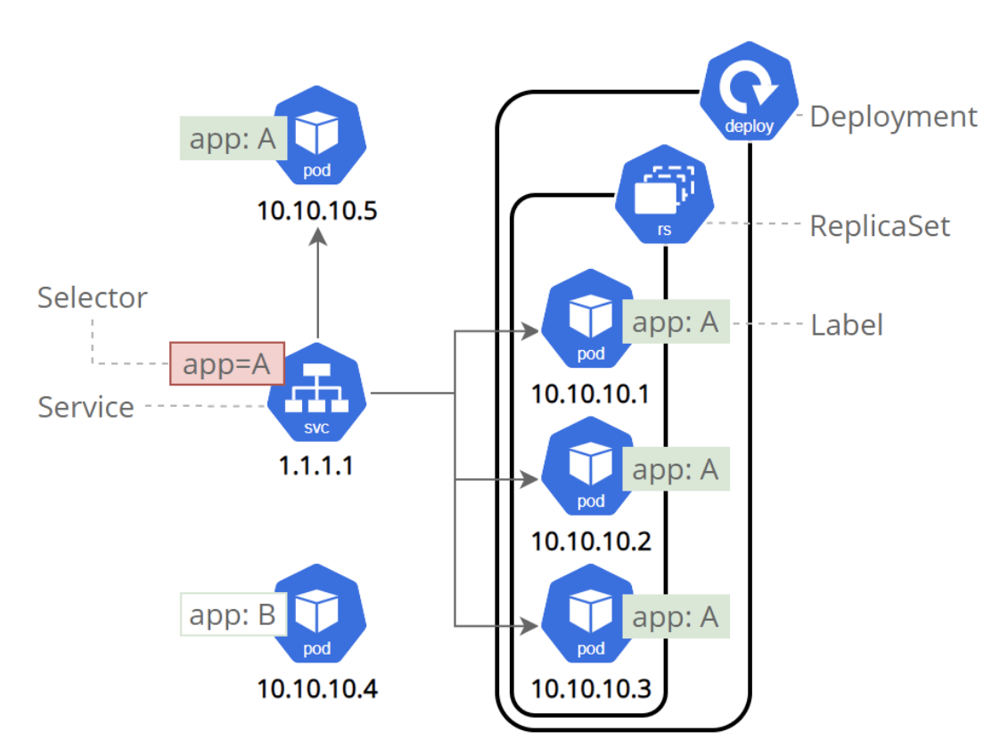

# Overview

The goal of this project is to deploy a microsoft service onto a kubernetes cluster using best practices in DevOps.  I will deploy the dagster hello world microservice tutorial.

## Simple Micorservice

- Flask app that triggers dagster container to execute a workflow.  The result of that workflow is then printed to the screen.
- The flask app has a simple button that says trigger.  Once triggered the dagster process goes off (the frontend shows processing).  And when done, shows the output of the dagster process

### Backend

The backend consist of two part: A service that polls a postgres database to see if any schema changes have happened. The second service processes schema changes using the orchestration tool called Dagster.  

### Frontend

Simple Flask app that prints backend results to screen.

## Tools Used in This Project

- [CircleCI](app.circleci.com)
- [AWS Kubernetes Service](https://www.eksworkshop.com/010_introduction/)
- [Kubernetes](https://kubernetes.io/docs/home/)
- [GitHub](https://github.com/acholonu/DevOps_Capstone)
- [Ansible](ttps://docs.ansible.com/ansible/latest/cli/ansible-playbook.html)
- [Prometheus Monitoring](#test)
- [EKS Tutorial](https://www.eksworkshop.com/010_introduction/)
- [EKS Tutorial Video](https://www.youtube.com/watch?v=-zmUxsrYw2I&t=7s)
- [Amazon Secrets Manager](https://aws.amazon.com/secrets-manager/)
- [Elastic Container Repository - ECR](https://aws.amazon.com/ecr/) I will use this instead of DockerHub, Maybe?
- [Postgres Image](https://hub.docker.com/_/postgres)
- [Bash Not Equal Operator](https://linuxtect.com/linux-bash-not-equal-ne-operators-tutorial/)
- [EKSCTL Minimum IAM Policy](https://eksctl.io/usage/minimum-iam-policies/)
- [EKSCTL Amazon Docs](https://docs.aws.amazon.com/eks/latest/userguide/eksctl.html)
- [Minikube Commands](https://minikube.sigs.k8s.io/docs/commands/)

## Files

- Makefile: mainly use so I can test the docker container configuration before implementing within the CircleCI framework.  Will test install pyenv or poetry inside of the container versus venv.
- Dockerfile: Creates the image that generates the container that will run the dagster app.

## References

- [Mutliple Dockerfiles in Project](https://stackoverflow.com/questions/27409761/docker-multiple-dockerfiles-in-project)
- [Dagster Example](https://github.com/dagster-io/dagster/tree/master/examples/hacker_news)
- [Run CircleCI on Local Machine](https://circleci.com/docs/2.0/local-cli/#processing-a-config)
- [How to Check Linux Version](https://www.cyberciti.biz/faq/how-to-check-os-version-in-linux-command-line/)
- [Creating VirtualEnvs with venv](https://docs.python.org/3/library/venv.html)
- [Python Application with CircleCi](https://circleci.com/docs/2.0/language-python/)
- [Udacity Capstone Examples](https://knowledge.udacity.com/questions/55383)
- [CircleCI Kubernetes](https://circleci.com/developer/orbs/orb/circleci/aws-eks#usage-create-eks-cluster)
- [Docker and Postgres DB](https://dev.to/andre347/how-to-easily-create-a-postgres-database-in-docker-4moj)
- [Database Security](https://docs.oracle.com/cd/B13789_01/network.101/b10773/apdvntro.htm)
- [Creating a Jumpbox](https://aws.amazon.com/premiumsupport/knowledge-center/rds-connect-ec2-bastion-host/)
- [Selenium Testing](https://www.selenium.dev/documentation/)
- [Build A Docker Image in CircleCI](https://circleci.com/blog/how-to-build-a-docker-image-on-circleci-2-0/)

---

## Kubernetes - Container Orchestration in Cloud-Based Production Environments

It is an open source orchestration system for containers developed by Google and open sourced in 2014. Kubernetes is the standard for container orchestration. All major cloud providers support Kubernetes. Kubernetes is also a framework for running distributed systems at "planet scale". Google uses it to run billions of containers a week.

The core operations involved in Kubernetes include creating a Kubernetes Cluster, deploying an application (a containerized microservice) into the cluster, exposing an application ports, scaling an application and updating an application.

Containers are a good way to bundle and run your applications. In a production environment, you need to manage the containers that run the applications and ensure that there is no downtime. For example, if a container goes down, another container needs to start. Wouldn't it be easier if this behavior was handled by a system? That's how Kubernetes comes to the rescue! Kubernetes provides you with a framework to run distributed systems resiliently. It takes care of scaling and failover for your application, provides deployment patterns, and more. For example, Kubernetes can easily manage a canary deployment for your system.

Kubernetes provides you with:

- Service discovery and load balancing Kubernetes can expose a container using the DNS name or using their own IP address. If traffic to a container is high, Kubernetes is able to load balance and distribute the network traffic so that the deployment is stable.
- Storage orchestration Kubernetes allows you to automatically mount a storage system of your choice, such as local storages, public cloud providers, and more.
- Automated rollouts and rollbacks You can describe the desired state for your deployed containers using Kubernetes, and it can change the actual state to the desired state at a controlled rate. For example, you can automate Kubernetes to create new containers for your deployment, remove existing containers and adopt all their resources to the new container.
- Automatic bin packing You provide Kubernetes with a cluster of nodes that it can use to run containerized tasks. You tell Kubernetes how much CPU and memory (RAM) each container needs. Kubernetes can fit containers onto your nodes to make the best use of your resources.
- Self-healing Kubernetes restarts containers that fail, replaces containers, kills containers that don't respond to your user-defined health check, and doesn't advertise them to clients until they are ready to serve.
- Secret and configuration management Kubernetes lets you store and manage sensitive information, such as passwords, OAuth tokens, and SSH keys. You can deploy and update secrets and application configuration without rebuilding your container images, and without exposing secrets in your stack configuration.

Kubernetes is not a mere orchestration system. It eliminates the need for orchestration. The technical definition of orchestration is execution of a defined workflow: first do A, then B, then C. **In contrast, Kubernetes comprises a set of independent, composable control processes that continuously drive the current state towards the provided desired state. It shouldn't matter how you get from A to C.** Centralized control is also not required. This results in a system that is easier to use and more powerful, robust, resilient, and extensible.



[More Details on Components of Kubernetes Cluster](https://kubernetes.io/docs/concepts/overview/components/#:~:text=The%20components%20of%20a%20Kubernetes%20cluster)

### Control Plane Componenets

*Note: Amazon EKS manages the control plane so you don't have to. That is what you are paying for.  You are also paying for the storage and computing power you use.*

The **control plane's** components make global decisions about the cluster (for example, scheduling), as well as detecting and responding to cluster events (for example, starting up a new pod when a deployment's replicas field is unsatisfied).

Control plane components can be run on any machine in the cluster. However, for simplicity, set up scripts typically start all control plane components on the same machine, and do not run user containers on this machine.

- **kub-apiserver**: The API server is a component of the Kubernetes control plane that exposes the Kubernetes API. The API server is the front end for the Kubernetes control plane. The **kubectl** commands get translated into this api and then executed.
- **etcd**: Key value storage use to store the cluster's state data. So if need to rebuild the cluster at the current state you can.  You should have backup of this storage. It is the only way to restore.
- **kube-scheduler**: Control plane component that watches for newly created `Pods` with no assigned node, and selects a node for them to run on.
- **kube-controller-manager**: Control plane component that runs controller processes. Some types of these controllers are:
  - *Node controller*: Responsible for noticing and responding when nodes go down.
  - *Job controller*: Watches for Job objects that represent one-off tasks, then creates Pods to run those tasks to completion.
  - *Endpoints controller*: Populates the Endpoints object (that is, joins Services & Pods).
  - *Service Account & Token controllers*: Create default accounts and API access tokens for new namespaces.
- **cloud-controller-manager**: A Kubernetes control plane component that embeds cloud-specific control logic. The cloud controller manager lets you link your cluster into your cloud provider's API, and separates out the components that interact with that cloud platform from components that only interact with your cluster. The cloud-controller-manager only runs controllers that are specific to your cloud provider. If you are running Kubernetes on your own premises, or in a learning environment inside your own PC, the cluster does not have a cloud controller manager. As with the kube-controller-manager, the cloud-controller-manager combines several logically independent control loops into a single binary that you run as a single process. You can scale horizontally (run more than one copy) to improve performance or to help tolerate failures. The following controllers can have cloud provider dependencies:
  - Node controller: For checking the cloud provider to determine if a node has been deleted in the cloud after it stops responding
  - Route controller: For setting up routes in the underlying cloud infrastructure
  - Service controller: For creating, updating and deleting cloud provider load balancers

### Node Components



*Note: on Amazon EKS, you manage this part; whereas Amazon ECS service abstracts this whole thing away from you so you just focus on the container*

Node components run on every node, maintaining running pods and providing the Kubernetes runtime environment.

**kubelet**: An agent that runs on each node in the cluster. It makes sure that containers are running in a Pod. The kubelet takes a set of `PodSpecs` that are provided through various mechanisms and ensures that the containers described in those PodSpecs are running and healthy. *The kubelet doesn't manage containers which were not created by Kubernetes*.

**kube-proxy**: is a network proxy that runs on each node in your cluster. It maintains network rules on nodes. These network rules allow network communication to your Pods from network sessions inside or outside of your cluster.

**container runtime**: The container runtime (like Docker) is responsible for pulling the container image from a registry, unpacking the container, and running the application.Kubernetes supports several container runtimes: Docker, containerd, CRI-O, and any implementation of the Kubernetes CRI (Container Runtime Interface).

---

## Understanding Kubernetes Objects

Kubernetes objects are persistent entities in the Kubernetes system. Kubernetes uses these entities to represent the `state` of your cluster. Specifically, they can describe:

- What containerized applications are running (and on which nodes)
- The resources available to those applications
- The policies around how those applications behave, such as restart policies, upgrades, and fault-tolerance.

**A Kubernetes object is a "record of intent"--once you create the object, the Kubernetes system will constantly work to ensure that object exists.** By creating an object, you're effectively telling the Kubernetes system what you want your cluster's workload to look like; this is your cluster's desired state.

To work with Kubernetes objects--whether to create, modify, or delete them--you'll need to use the Kubernetes API. When you use the `kubectl` command-line interface, for example, the CLI makes the necessary Kubernetes API calls for you.

### Object Spec and Status

Almost every Kubernetes object includes two nested object fields that govern the object's configuration: the object `spec` and the object `status`. For objects that have a spec, you have to set this when you create the object, providing a description of the characteristics you want the resource to have: its desired state.

The status describes the current state of the object, supplied and updated by the Kubernetes system and its components. The Kubernetes control plane continually and actively manages every object's actual state to match the desired state you supplied.

#### I like this example

For example: in Kubernetes, a Deployment is an object that can represent an application running on your cluster. When you create the Deployment, you might set the Deployment spec to specify that you want three replicas of the application to be running. The Kubernetes system reads the Deployment spec and starts three instances of your desired application--updating the status to match your spec. If any of those instances should fail (a status change), the Kubernetes system responds to the difference between spec and status by making a correction--in this case, starting a replacement instance.

### Services and Labels in Kubernetes

In Kubernetes, a Service is an abstraction which defines a logical set of Pods and a policy by which to access them (sometimes this pattern is called a micro-service). The set of Pods targeted by a Service is usually determined by a selector.

Example:

```yaml
apiVersion: v1
kind: Service
metadata:
  name: my-service
spec:
  selector:
    app: MyApp
  ports:
    - protocol: TCP
      port: 80
      targetPort: 9376
```

This specification creates a new Service object named "my-service", which targets TCP port `9376` on any Pod with the app=`MyApp` label.

Kubernetes assigns this Service an IP address (sometimes called the "cluster IP"), which is used by the Service proxies (see Virtual IPs and service proxies below).

The controller for the Service selector continuously scans for Pods that match its selector, and then POSTs any updates to an Endpoint object also named "my-service".

Although each Pod has a unique IP address, those IPs are not exposed outside the cluster without a Service. Services allow your applications to receive traffic. A Service routes traffic across a set of Pods. Discovery and routing among dependent Pods (such as the frontend and backend components in an application) is handled by Kubernetes Services. Services can be exposed in different ways by specifying a type in the ServiceSpec:

- **ClusterIP (default)** - Exposes the Service on an internal IP in the cluster. This type makes the Service only reachable from within the cluster.
- **NodePort** - Exposes the Service on the same port of each selected Node in the cluster using NAT. Makes a Service accessible from outside the cluster using `<NodeIP>:<NodePort>`. Superset of ClusterIP.
- **LoadBalancer** - Creates an external load balancer in the current cloud (if supported) and assigns a fixed, external IP to the Service. Superset of NodePort. (`What I'll be using`)
- **ExternalName** - Maps the Service to the contents of the externalName field (e.g. foo.bar.example.com), by returning a CNAME record with its value. No proxying of any kind is set up. This type requires v1.7 or higher of kube-dns, or CoreDNS version 0.0.8 or higher.

Services match a set of Pods using labels and selectors



Additionally, note that there are some use cases with Services that involve not defining selector in the spec. A Service created without selector will also not create the corresponding Endpoints object. This allows users to manually map a Service to specific endpoints. Another possibility why there may be no selector is you are strictly using type: ExternalName.

### Describing a Kubernetes Object

When you create an object in Kubernetes, you must provide the object spec that describes its desired state, as well as some basic information about the object (such as a name). Most often, you provide the information to kubectl in a .yaml file. kubectl converts the information to JSON when making the API request. **See example file below**:

```yaml
apiVersion: apps/v1 # version of the Kubernetes API you're using to create this object
kind: Deployment #Type of Object you want to create
metadata: # Data that helps you uniquely identify the object (e.g., name, namespace, UID)
  name: nginx-deployment
spec: # What state you desire for the object
  selector:
    matchLabels:
      app: nginx
  replicas: 2 # tells deployment to run 2 pods matching the template
  template:
    metadata:
      labels:
        app: nginx
    spec:
      containers:
      - name: nginx
        image: nginx:1.14.2
        ports:
        - containerPort: 80
```

To create the deployment using a `/yaml` file like the example shown above use the `kubectl apply` command and pass in the file.

`kubectl apply -f https://k8s.io/examples/application/deployment.yaml --record`

The precise format of the object `spec` is different for every Kubernetes object, and contains nested fields specific to that object. The Kubernetes API Reference can help you find the spec format for all of the objects you can create using Kubernetes.

For example, the reference for Pod details the spec field for a Pod in the API, and the reference for Deployment details the spec field for Deployments. In those API reference pages you'll see mention of PodSpec and DeploymentSpec. These names are implementation details of the Golang code that Kubernetes uses to implement its API.

#### Object Names and IDs

Each object in your cluster has a `Name` that is unique for that **type of resource**. Every Kubernetes object also has a `UID` that is unique across your whole cluster.

For example, you can only have one `Pod` named *myapp-1234* within the same `namespace`, but you can have one `Pod` and one `Deployment` that are each named **myapp-1234**.

For non-unique user-provided attributes, Kubernetes provides `labels` and `annotations`.

#### Namespaces

In Kubernetes, namespaces provides a mechanism for isolating groups of resources within a single cluster. Names of resources need to be unique within a namespace, but not across namespaces. Namespace-based scoping is applicable only for namespaced objects (e.g. Deployments, Services, etc) and not for cluster-wide objects (e.g. StorageClass, Nodes, PersistentVolumes, etc).

Namespaces are intended for use in environments with many users spread across multiple teams, or projects. For clusters with a few to tens of users, you should not need to create or think about namespaces at all. Start using namespaces when you need the features they provide.

#### Pods

`Pods` are the smallest deployable units of computing that you can create and manage in Kubernetes. A `Pod` (as in a pod of whales or pea pod) is a group of one or more containers, with shared storage and network resources, and a specification for how to run the containers.

A Pod's contents are always co-located and co-scheduled, and run in a shared context. A Pod models an application-specific "logical host": it contains one or more application containers which are relatively tightly coupled.

Pod can contain init containers that run during Pod startup. You can also inject ephemeral containers for debugging if your cluster offers this.

In terms of Docker concepts, a Pod is similar to a group of Docker containers with shared namespaces and shared filesystem volumes.

The following is an example of a Pod which consists of a container running the image nginx:1.14.2.

```yaml
# File name: pods/simple-pod.yaml
apiVersion: v1
kind: Pod
metadata:
  name: nginx
spec:
  containers:
  - name: nginx
    image: nginx:1.14.2
    ports:
    - containerPort: 80
```

To Create the Pod in Kubernetes: use kubectl :

`kubectl apply -f https://k8s.io/examples/pods/simple-pod.yaml`

Pods are generally not created directly and are created using workload resources. See Working with Pods for more information on how Pods are used with workload resources.

#### Workload resources for managing pods

Usually you don't need to create Pods directly, even singleton Pods. Instead, create them using workload resources such as Deployment or Job. If your Pods need to track state, consider the StatefulSet resource.

- Pods that run a single container. The "one-container-per-Pod" model is the most common Kubernetes use case; in this case, you can think of a Pod as a wrapper around a single container; Kubernetes manages Pods rather than managing the containers directly.

- Pods that run multiple containers that need to work together. A Pod can encapsulate an application composed of multiple co-located containers that are tightly coupled and need to share resources. These co-located containers form a single cohesive unit of service—for example, one container serving data stored in a shared volume to the public, while a separate sidecar container refreshes or updates those files. The Pod wraps these containers, storage resources, and an ephemeral network identity together as a single unit.

*Note: Grouping multiple co-located and co-managed containers in a single Pod is a relatively advanced use case. You should use this pattern only in specific instances in which your containers are tightly coupled.*

Some Pods have `init containers` as well as `app containers`. Init containers run and complete before the app containers are started. Pods natively provide two kinds of shared resources for their constituent containers: networking and storage.

You'll rarely create individual Pods directly in Kubernetes—even singleton Pods. This is because Pods are designed as relatively ephemeral, disposable entities. When a Pod gets created (directly by you, or indirectly by a controller), the new Pod is scheduled to run on a Node in your cluster. The Pod remains on that node until the Pod finishes execution, the Pod object is deleted, the Pod is evicted for lack of resources, or the node fails.

*Note: Restarting a container in a Pod should not be confused with restarting a Pod. A Pod is not a process, but an environment for running container(s). A Pod persists until it is deleted.*

**Kubernetes provides several built-in workload resources**:

Note: A stateless app is an application program that does not save client data generated in one session for use in the next session with that client. In contrast, a stateful application saves data about each client session and uses that data the next time the client makes a request.

- **Deployment and ReplicaSet**: is a good fit for managing a stateless application workload on your cluster, where any Pod in the Deployment is interchangeable and can be replaced if needed.
- **StatefulSet** lets you run one or more related Pods that do track state somehow. For example, if your workload records data persistently, you can run a StatefulSet that matches each Pod with a PersistentVolume. Your code, running in the Pods for that StatefulSet, can replicate data to other Pods in the same StatefulSet to improve overall resilience.
- **DaemonSet** defines Pods that provide node-local facilities. These might be fundamental to the operation of your cluster, such as a networking helper tool, or be part of an add-on.
Every time you add a node to your cluster that matches the specification in a DaemonSet, the control plane schedules a Pod for that DaemonSet onto the new node.
- **Job and CronJob** define tasks that run to completion and then stop. Jobs represent one-off tasks, whereas CronJobs recur according to a schedule.

#### Pods and controllers

You can use workload resources to create and manage multiple Pods for you. A controller for the resource handles replication and rollout and automatic healing in case of Pod failure. For example, if a Node fails, a controller notices that Pods on that Node have stopped working and creates a replacement Pod. The scheduler places the replacement Pod onto a healthy Node.

Here are some examples of workload resources that manage one or more Pods:

- [Deployment](https://kubernetes.io/docs/concepts/workloads/controllers/deployment/)
- [StatefulSet](https://kubernetes.io/docs/concepts/workloads/controllers/statefulset/)
- [DaemonSet](https://kubernetes.io/docs/concepts/workloads/controllers/daemonset)

#### Pod templates

Controllers for workload resources create Pods from a pod template and manage those Pods on your behalf.

PodTemplates are specifications for creating Pods, and are included in workload resources such as Deployments, Jobs, and DaemonSets.

Each controller for a workload resource uses the PodTemplate inside the workload object to make actual Pods. The PodTemplate is part of the desired state of whatever workload resource you used to run your app.

The sample below is a manifest for a simple Job with a template that starts one container. The container in that Pod prints a message then pauses.

```yaml
apiVersion: batch/v1
kind: Job
metadata:
  name: hello
spec:
  template:
    # This is the pod template
    spec:
      containers:
      - name: hello
        image: busybox
        command: ['sh', '-c', 'echo "Hello, Kubernetes!" && sleep 3600']
      restartPolicy: OnFailure
    # The pod template ends here
```
Modifying the pod template or switching to a new pod template has no direct effect on the Pods that already exist. If you change the pod template for a workload resource, that resource needs to create replacement Pods that use the updated template.

For example, the StatefulSet controller ensures that the running Pods match the current pod template for each StatefulSet object. If you edit the StatefulSet to change its pod template, the StatefulSet starts to create new Pods based on the updated template. Eventually, all of the old Pods are replaced with new Pods, and the update is complete.

Each workload resource implements its own rules for handling changes to the Pod template.

---

### Resource sharing and communication

Pods enable data sharing and communication among their constituent containers.

#### Storage in Pods

A Pod can specify a set of shared storage volumes. All containers in the Pod can access the shared volumes, allowing those containers to share data. Volumes also allow persistent data in a Pod to survive in case one of the containers within needs to be restarted. See Storage for more information on how Kubernetes implements shared storage and makes it available to Pods.

#### Pod networking

Each Pod is assigned a unique IP address for each address family. Every container in a Pod shares the network namespace, including the IP address and network ports. Inside a Pod (and only then), the containers that belong to the Pod can communicate with one another using localhost. When containers in a Pod communicate with entities outside the Pod, they must coordinate how they use the shared network resources (such as ports). Within a Pod, containers share an IP address and port space, and can find each other via localhost. The containers in a Pod can also communicate with each other using standard inter-process communications like SystemV semaphores or POSIX shared memory. Containers in different Pods have distinct IP addresses and can not communicate by IPC without special configuration. Containers that want to interact with a container running in a different Pod can use IP networking to communicate.

Containers within the Pod see the system hostname as being the same as the configured name for the Pod. There's more about this in the networking section.

### Defining an AWS EBS Volume to store pesistant data

#### awsElasticBlockStore

An awsElasticBlockStore volume mounts an Amazon Web Services (AWS) EBS volume into your pod. Unlike emptyDir, which is erased when a pod is removed, the contents of an EBS volume are persisted and the volume is unmounted. This means that an EBS volume can be pre-populated with data, and that data can be shared between pods. You must create an EBS volume by using aws ec2 create-volume or the AWS API before you can use it. Make sure the zone matches the zone you brought up your cluster in. Check that the size and EBS volume type are suitable for your use.

`aws ec2 create-volume --availability-zone=eu-west-1a --size=10 --volume-type=gp2`

There are some restrictions when using an awsElasticBlockStore volume:

- the nodes on which pods are running must be AWS EC2 instances
- those instances need to be in the same region and availability zone as the EBS volume
- EBS only supports a single EC2 instance mounting a volume

#### Example AWS EBS configuration

**Again the volume must be created first before executing this configuration file.**

```yaml
apiVersion: v1
kind: Pod
metadata:
  name: test-ebs
spec:
  containers:
  - image: k8s.gcr.io/test-webserver
    name: test-container
    volumeMounts:
    - mountPath: /test-ebs
      name: test-volume
  volumes:
  - name: test-volume
    # This AWS EBS volume must already exist.
    awsElasticBlockStore:
      volumeID: "<volume id>"
      fsType: ext4
```

#### Example MySQL Service Deployment definition

```yaml
# application/mysql/mysql-deployment.yaml
apiVersion: v1
kind: Service
metadata:
  name: mysql
spec:
  ports:
  - port: 3306
  selector:
    app: mysql
  clusterIP: None
---
apiVersion: apps/v1
kind: Deployment
metadata:
  name: mysql
spec:
  selector:
    matchLabels:
      app: mysql
  strategy:
    type: Recreate
  template:
    metadata:
      labels:
        app: mysql
    spec:
      containers:
      - image: mysql:5.6
        name: mysql
        env:
          # Use secret in real usage
        - name: MYSQL_ROOT_PASSWORD
          value: password
        ports:
        - containerPort: 3306
          name: mysql
        volumeMounts:
        - name: mysql-persistent-storage
          mountPath: /var/lib/mysql
      volumes:
      - name: mysql-persistent-storage
        persistentVolumeClaim:
          claimName: mysql-pv-claim
```

#### Example Persistent volume definition for MySQL app

```yaml
# application/mysql/mysql-pv.yaml
apiVersion: v1
kind: PersistentVolume
metadata:
  name: mysql-pv-volume
  labels:
    type: local
spec:
  storageClassName: manual
  capacity:
    storage: 20Gi
  accessModes:
    - ReadWriteOnce
  hostPath:
    path: "/mnt/data"
---
apiVersion: v1
kind: PersistentVolumeClaim
metadata:
  name: mysql-pv-claim
spec:
  storageClassName: manual
  accessModes:
    - ReadWriteOnce
  resources:
    requests:
      storage: 20Gi
```

#### Steps to deploy volume and mysql app

1. Deploy the Persistent volume and persistent volume claim
  - `kubectl apply -f https://k8s.io/examples/application/mysql/mysql-pv.yaml`
2. Deploy the contents of the YAML file:
  - `kubectl apply -f https://k8s.io/examples/application/mysql/mysql-deployment.yaml`
3. Display information about the Deployment:
  - `kubectl describe deployment mysql`
4. List the pods created by the Deployment:
  `kubectl get pods -l app=mysql`
5. Inspect the PersistentVolumeClaim
  - `kubectl describe pvc mysql-pv-claim`
6. Test the mysql database
  - `kubectl run -it --rm --image=mysql:5.6 --restart=Never mysql-client -- mysql -h mysql -ppassword`
  - The `kubectl run` command, create and runs a particular image in a pod

#### Deleting a Deployment

```bash
kubectl delete deployment,svc mysql
kubectl delete pvc mysql-pv-claim
kubectl delete pv mysql-pv-volume
```

### Pod with multiple containers

[Reference](https://kubernetes.io/docs/tasks/access-application-cluster/communicate-containers-same-pod-shared-volume/)

In the configuration file, you can see that the Pod has a Volume named shared-data. The first container listed in the configuration file runs an nginx server. The mount path for the shared Volume is `/usr/share/nginx/html`. The second container is based on the debian image, and has a mount path of `/pod-data`. The second container runs the following command and then terminates. `echo Hello from the debian container > /pod-data/index.html`. Notice that the second container writes the index.html file in the root directory of the nginx server.

Create the Pod and two Containers:

`kubectl apply -f https://k8s.io/examples/pods/two-container-pod.yaml`

View information about the pod and the containers

`kubectl get pod two-containers --output=yaml`

```yaml
# pods/two-container-pod.yaml
apiVersion: v1
kind: Pod
metadata:
  name: two-containers
spec:

  restartPolicy: Never

  volumes:
  - name: shared-data
    emptyDir: {}

  containers:

  - name: nginx-container
    image: nginx
    volumeMounts:
    - name: shared-data
      mountPath: /usr/share/nginx/html

# Helper Pod
  - name: debian-container
    image: debian
    volumeMounts:
    - name: shared-data
      mountPath: /pod-data
    command: ["/bin/sh"]
    args: ["-c", "echo Hello from the debian container > /pod-data/index.html"]
```

The primary reason that Pods can have multiple containers is to support helper applications that assist a primary application. Typical examples of helper applications are data pullers, data pushers, and proxies. Helper and primary applications often need to communicate with each other. Typically this is done through a shared filesystem, as shown in this exercise, or through the loopback network interface, localhost. An example of this pattern is a web server along with a helper program that polls a Git repository for new updates.

The Volume in this exercise provides a way for Containers to communicate during the life of the Pod. If the Pod is deleted and recreated, any data stored in the shared Volume is lost.

---

## Notes to Self

- To check path of poetry environment use the command `poetry env info`.  My path is currently located at /~/Library/Caches/pypoetry/virtualenvs/capstone-XWfwnle5-py3.10.  So to reactivate this virtual environment I would use:
  - `source ~/Library/Caches/pypoetry/virtualenvs/capstone-XWfwnle5-py3.10 activate`
- Ran into a warning in the construction of my Dockerfile (i.e., Dockerfile:10 DL4006 warning: Set the SHELL option -o pipefail before RUN with a pipe in it).  Here are the two URLs that helped me fixed these errors.
  - <https://githubmemory.com/repo/hadolint/hadolint/issues/724>
  - <https://github.com/hadolint/hadolint/wiki/DL4006>
- The pylintrc file is the configuration file for the pylint package.  I generated this config file typing the following command `pylint --generate-rcfile > pylintrc`. More information can be found here: <https://pylint.pycqa.org/en/latest/user_guide/options.html>.
- **Date 11/24/2021** - I really should separate these two application (Dagster and Flask app).  They should each have their own work flow and repository.  Then I would not be duplicating so much of my CI/CD.  Also, it would allow me to more easily explore where I which environment I want to deploy process too. I will continue with Dagster. You need a repository for each thing you want to deploy.
- [Something to help with dagster.yaml file](https://github.com/dagster-io/dagster/issues/3079)
- [Pytest Coverage](https://breadcrumbscollector.tech/how-to-use-code-coverage-in-python-with-pytest/)
- [Wget for downloading content to linux](https://linuxize.com/post/wget-command-examples/)
- [Permission Denied: execute bash script](https://careerkarma.com/blog/bash-permission-denied-solution/)
- [Exit from Bash Script on Failure of Command](https://intoli.com/blog/exit-on-errors-in-bash-scripts/)
- [mkdir options](https://www.javatpoint.com/linux-mkdir-p)
- To execute the environement file use the following commands: `source .env`
- [What is the difference between 127.0.0.1 and 0.0.0.0](https://www.howtogeek.com/225487/what-is-the-difference-between-127.0.0.1-and-0.0.0.0/#:~:text=In%20the%20context%20of%20servers,has%20two%20IP%20addresses%2C%20192.168.&text=2.1%2C%20and%20a%20server%20running,at%20both%20of%20those%20IPs.)
  - `127.0.0.1` is the loopback address (also known as localhost). The address is used to establish an IP connection to the same machine or computer being used by the end-user.
  - `0.0.0.0` is a non-routable meta-address used to designate an invalid, unknown, or non-applicable target (a ‘no particular address’ place holder). In the context of a route entry, it usually means the default route. In the context of servers, 0.0.0.0 means all IPv4 addresses on the local machine. If a host has two IP addresses, 192.168.1.1 and 10.1.2.1, and a server running on the host listens on 0.0.0.0, it will be reachable at both of those IPs.
- [Docker Layers Reference 1](https://dzone.com/articles/docker-layers-explained)
- [Docker Layers Reference 2](https://jessicagreben.medium.com/digging-into-docker-layers-c22f948ed612)
- [Dockerfile Best Practices](https://docs.docker.com/develop/develop-images/dockerfile_best-practices/)
- [What does backslash do at the end](https://unix.stackexchange.com/questions/368753/what-does-this-command-with-a-backslash-at-the-end-do)
- A database cluster is a collection of databases that are managed by a single server instance.
- [Setting default variable values in bash scripts](https://stackoverflow.com/questions/2013547/assigning-default-values-to-shell-variables-with-a-single-command-in-bash)
- [Setting default arguments](https://stackoverflow.com/questions/9332802/how-to-write-a-bash-script-that-takes-optional-input-arguments)
- [Understand Entrypoints](https://docs.docker.com/engine/reference/builder/#entrypoint)
- [Docker compose, Flask App & PostgresDB](https://levelup.gitconnected.com/dockerizing-a-flask-application-with-a-postgres-database-b5e5bfc24848)
- [Docker compose another example](https://levelup.gitconnected.com/creating-and-filling-a-postgres-db-with-docker-compose-e1607f6f882f)
- [Top 30 Git Commands to Master](https://levelup.gitconnected.com/top-30-git-commands-you-should-know-to-master-git-cli-f04e041779bc)
- [Networking in Docker Compose](https://docs.docker.com/compose/networking/)
- [Docker Compose in Production](https://docs.docker.com/compose/production/)
- [Docker-Compose Command Reference](https://docs.docker.com/compose/reference/push/)
- [Docker-Compose to Kubernetes](https://loft.sh/blog/docker-compose-to-kubernetes-step-by-step-migration/)
  - Docker-Compose combines microservices into 1 docker file.  However, this microservice is supposed to run on one host (one virtual machine or computer).  Kubernetes runs containers across many hosts (virtual machines).  So microservices (which are multiple containers) may not all be on the same hosts. When working with a Docker Compose-based application, the server running the application must be kept running for the application to continue working. This means the server running Compose becomes a single point of failure. In contrast, Kubernetes usually is run in a highly available (HA) state with multiple servers that deploy and maintain the application to the different nodes. Kubernetes also manages the scaling of the nodes based on resource utilization.
- [Kubectl Command Reference](https://kubernetes.io/docs/reference/generated/kubectl/kubectl-commands#run)
- [Managing Secrets in Kubernetes](https://kubernetes.io/docs/tasks/configmap-secret/managing-secret-using-kubectl/)
