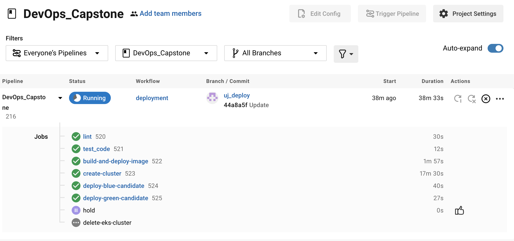
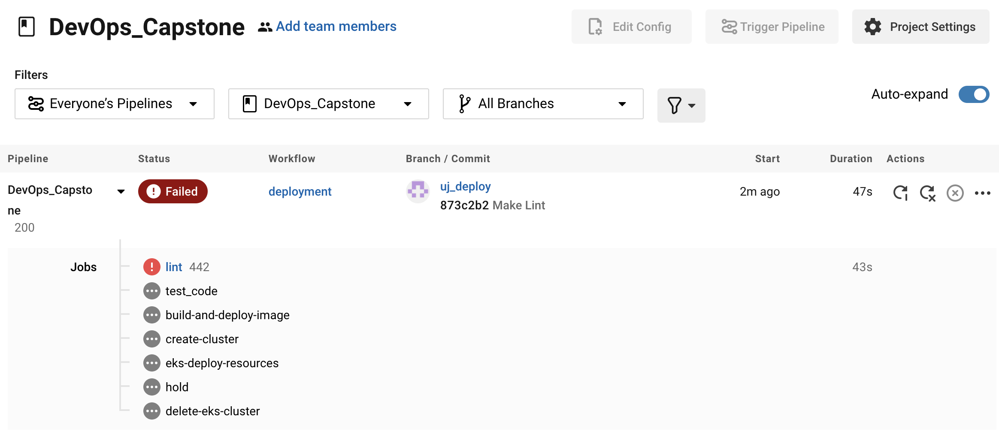
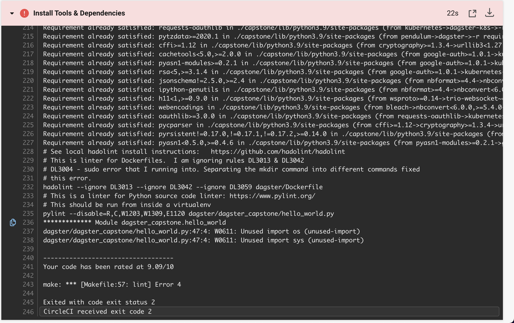
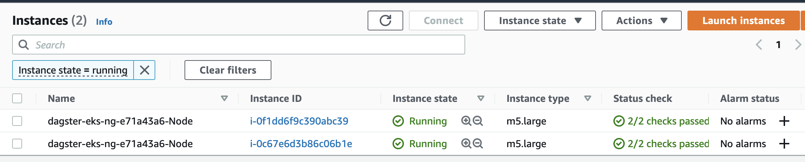
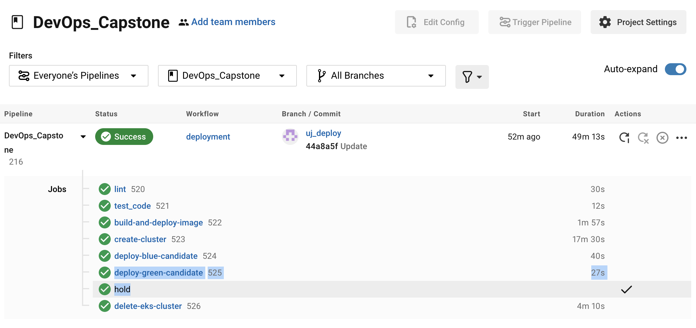

# Overview

Provides the desired links and screenshots requested for Udacity Project.  I am choosing to do a blue/green deployment.  So I am basically swapping out the production image (blue deployment) with the newly built image from the CI/CD protocol.  I will used Docker as my image repository.  And I will deploy on AWS K8S.

## Link to GitHub Repo

<https://github.com/acholonu/DevOps_Capstone>

### Docker File

You can find the docker file in the following path in the GitHub repository: ~/dagster/Dockerfile

## Screenshots of Lint Stage

Include with your Linting step both a failed Linting screenshot and a successful Linting screenshot to show the Linter working properly.

**Successful Lint**:

**Unsuccessful Lint**:

## Deployment

Take a screenshot of the Circle CI or Jenkins pipeline showing deployment, and a screenshot of your AWS EC2 page showing the newly created (for blue/green) or modified (for rolling) instances. Make sure you name your instances differently between blue and green deployments.

### Successful CI/CD Deployment

## Cloudformation and EKSCTL

I used eksctl to create my cluster (which underneath the hood uses cloudformation) and deploy my application.  Please see links for verification that this is acceptable.

See <https://knowledge.udacity.com/questions/584439> and <https://knowledge.udacity.com/questions/159823>
